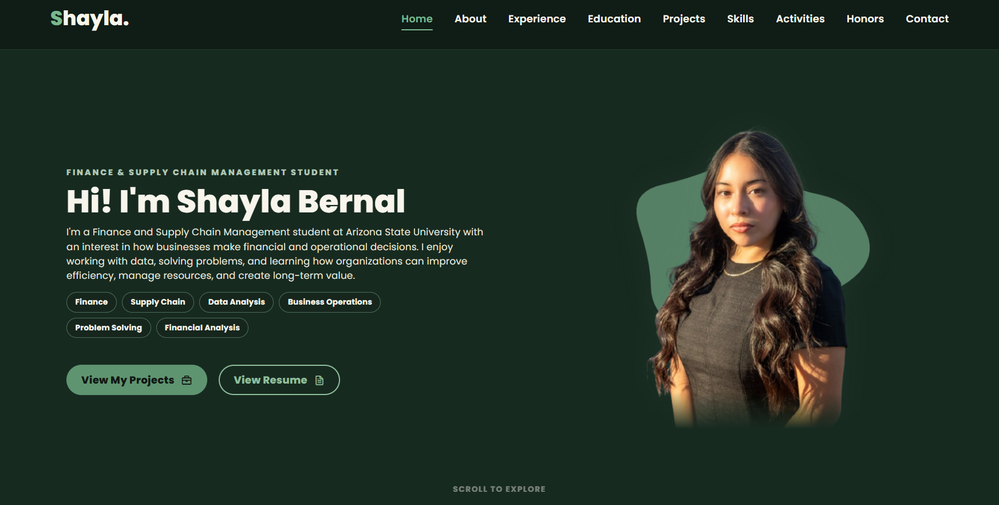
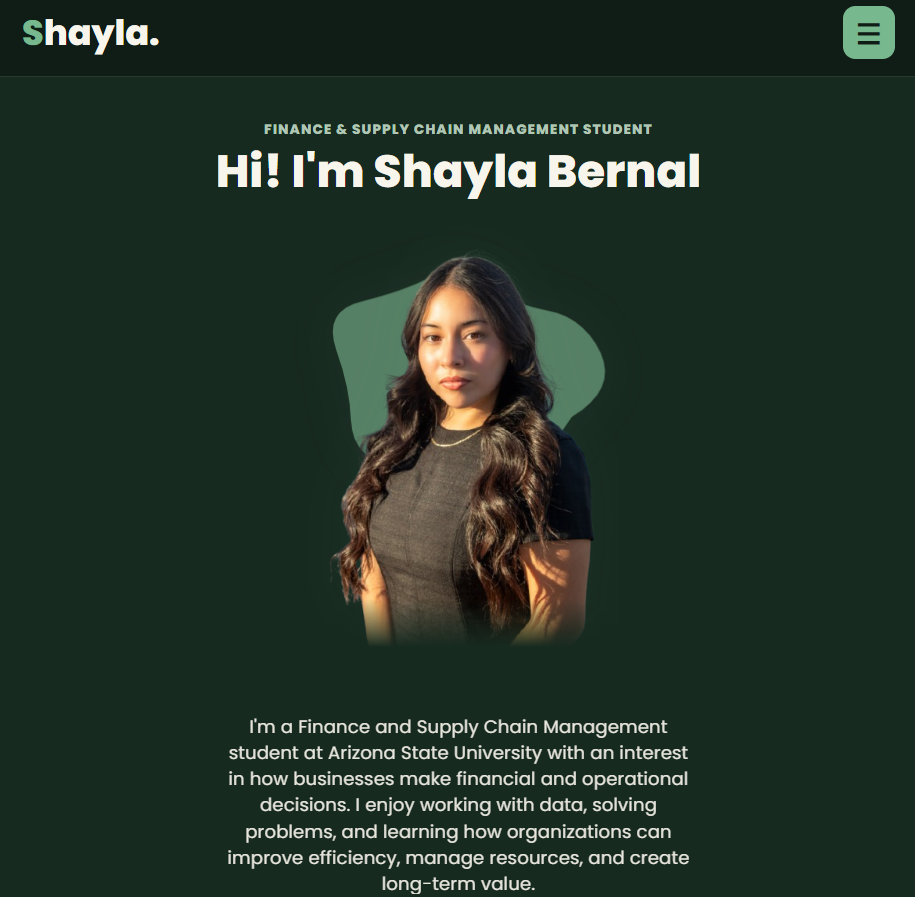

# 💼 Client Portfolio Website

A responsive portfolio website designed and developed for a client to showcase her professional experience, education, projects, skills, activities, and honors.

I built the website from the ground up with HTML, CSS, and JavaScript, created a design around the client's content and personal branding, and deployed the finished site through GitHub Pages with a custom domain and HTTPS.

🌐 **Live Website:** [shaylabernal.com](https://shaylabernal.com)

---

## 🛠️ Technologies Used

- HTML5
- CSS3
- JavaScript
- EmailJS
- Git & GitHub
- GitHub Pages
- Custom Domain
- HTTPS
- Visual Studio Code

---

## 🎨 1. Design the Client Portfolio

I started by organizing the client's information into a portfolio that would be easy to navigate and present her background professionally.

The website includes sections for:

- Home
- About
- Experience
- Education
- Skills
- Projects
- Activities
- Honors
- Contact

I created a custom visual style using a green and neutral color palette, consistent typography, cards, buttons, and section layouts throughout the website.

Rather than using a website builder or portfolio template, I created the structure and styling directly with HTML and CSS.

### Desktop



---

## 📱 2. Build the Responsive Layout

I designed the website to work across desktop, tablet, and mobile screen sizes.

As the screen gets smaller, the layout adjusts its:

- Navigation
- Content positioning
- Cards and grids
- Images
- Typography
- Spacing
- Buttons
- Forms

The desktop navigation also changes to a hamburger menu on smaller screens so the website remains easy to navigate.

### Responsive



### Mobile


---

## ⚙️ 3. Add Website Interactions

I used JavaScript to handle the interactive parts of the website.

The site includes:

- Responsive navigation
- Mobile hamburger menu
- Active navigation states
- Interactive buttons and links
- Contact form behavior
- Success and error messages

I also included keyboard focus states and reduced-motion support to improve accessibility.

---

## 📬 4. Connect the Contact Form

I connected the website's contact form to **EmailJS** so visitors can send messages directly through the website without requiring a custom backend server.

The form collects:

- Name
- Email
- Subject
- Message

JavaScript handles the form submission and displays a success or error message depending on the result.

```text
Visitor
   │
   ▼
Contact Form
   │
   ▼
EmailJS
   │
   ▼
Client Email
```

---

## 📄 5. Add Resume Access

I added the client's resume to the website as a PDF so visitors can easily access her professional information.

The resume is stored within the project's assets:

```text
assets/documents/resume.pdf
```

Keeping documents separate from images and other website assets makes the project easier to organize and maintain.

---

## 🌐 6. Deploy the Website

Once the website was ready, I pushed the project to GitHub and deployed it using GitHub Pages.

The deployment flow is:

```text
Local Development
       │
       ▼
      Git
       │
       ▼
     GitHub
       │
       ▼
 GitHub Pages
       │
       ▼
 Custom Domain
       │
       ▼
shaylabernal.com
```

I connected the custom domain and configured HTTPS so the finished website could be accessed securely through:

**[shaylabernal.com](https://shaylabernal.com)**

---

## 🧠 What I Learned

Building a website for someone else gave me experience working with requirements beyond my own preferences.

I practiced:

- Turning client information into a structured website
- Creating a consistent visual design across multiple sections
- Building responsive layouts with HTML and CSS
- Using JavaScript for navigation and interface behavior
- Creating a mobile navigation system
- Integrating a contact form with EmailJS
- Organizing website images, documents, and other assets
- Testing layouts across different screen sizes
- Using Git and GitHub to manage changes
- Deploying a website with GitHub Pages
- Connecting a custom domain and HTTPS

The biggest takeaway was learning how to take someone else's content and requirements and turn them into a complete website that works across different devices.

---

## 📁 Repository Structure

```text
client-portfolio-website/
│
├── .github/
│
├── assets/
│   ├── documents/
│   │   └── resume.pdf
│   │
│   ├── favicons/
│   │   ├── apple-touch-icon.png
│   │   ├── favicon-96x96.png
│   │   ├── favicon.ico
│   │   ├── favicon.svg
│   │   ├── site.webmanifest
│   │   ├── web-app-manifest-192x192.png
│   │   └── web-app-manifest-512x512.png
│   │
│   └── images/
│       ├── about/
│       ├── activities/
│       ├── education/
│       ├── experience/
│       └── home/
│
├── CNAME
├── README.md
├── index.html
├── script.js
└── style.css
```
